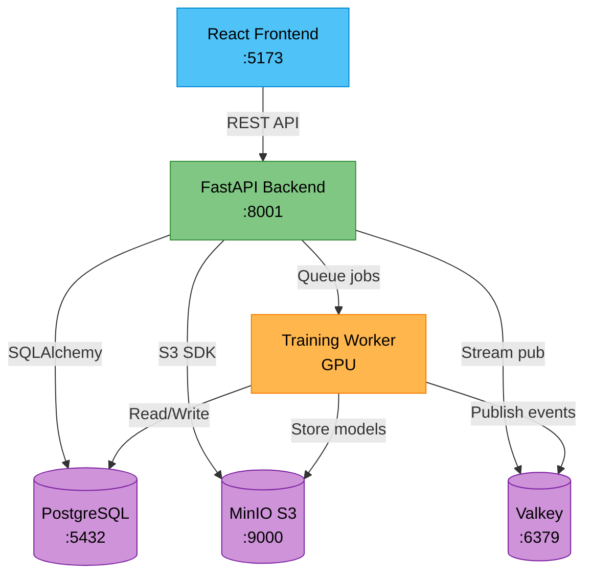
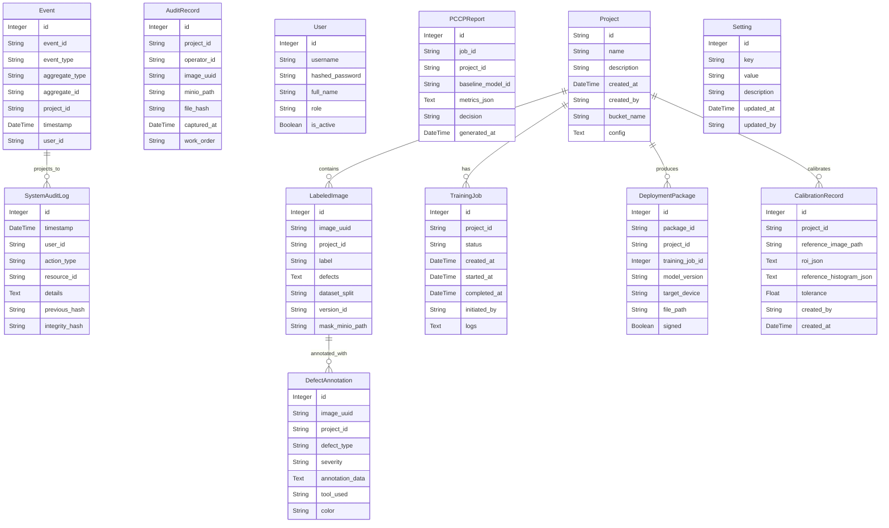

# Architecture Documentation

> Auto-generated on 2026-03-24 04:21:34 | Optoz AI Documentation Watcher

---

## Service Dependency Diagram

## Database Models

### `Event` (table: `events`)

| Column | Type |
| --- | --- |
| id | Integer |
| event_id | String |
| event_type | String |
| aggregate_type | String |
| aggregate_id | String |
| project_id | String |
| timestamp | DateTime |
| user_id | String |
| payload | Text |
| event_metadata | Text |
| previous_hash | String |
| integrity_hash | String |

### `AuditRecord` (table: `audit_trail`)

| Column | Type |
| --- | --- |
| id | Integer |
| project_id | String |
| operator_id | String |
| image_uuid | String |
| minio_path | String |
| file_hash | String |
| captured_at | DateTime |
| work_order | String |

### `User` (table: `users`)

| Column | Type |
| --- | --- |
| id | Integer |
| username | String |
| hashed_password | String |
| full_name | String |
| role | String |
| is_active | Boolean |

### `SystemAuditLog` (table: `system_audit_logs`)

| Column | Type |
| --- | --- |
| id | Integer |
| timestamp | DateTime |
| user_id | String |
| action_type | String |
| resource_id | String |
| details | Text |
| previous_hash | String |
| integrity_hash | String |

### `PCCPReport` (table: `pccp_reports`)

| Column | Type |
| --- | --- |
| id | Integer |
| job_id | String |
| project_id | String |
| baseline_model_id | String |
| metrics_json | Text |
| decision | String |
| generated_at | DateTime |

### `LabeledImage` (table: `labeled_images`)

| Column | Type |
| --- | --- |
| id | Integer |
| image_uuid | String |
| project_id | String |
| label | String |
| defects | Text |
| dataset_split | String |
| version_id | String |
| mask_minio_path | String |
| has_mask | Boolean |
| labeled_by | String |
| labeled_at | DateTime |
| is_locked | Boolean |

### `DefectAnnotation` (table: `defect_annotations`)

| Column | Type |
| --- | --- |
| id | Integer |
| image_uuid | String |
| project_id | String |
| defect_type | String |
| severity | String |
| annotation_data | Text |
| tool_used | String |
| color | String |
| created_by | String |
| created_at | DateTime |

### `Project` (table: `projects`)

| Column | Type |
| --- | --- |
| id | String |
| name | String |
| description | String |
| created_at | DateTime |
| created_by | String |
| bucket_name | String |
| config | Text |

### `TrainingJob` (table: `training_jobs`)

| Column | Type |
| --- | --- |
| id | Integer |
| project_id | String |
| status | String |
| created_at | DateTime |
| started_at | DateTime |
| completed_at | DateTime |
| initiated_by | String |
| logs | Text |
| metrics_json | Text |
| current_epoch | Integer |
| total_epochs | Integer |
| progress_percent | Integer |
| model_name | String |
| mode | String |
| parent_job_id | Integer |
| exploratory_rank | Integer |
| best_metric | Float |

### `DeploymentPackage` (table: `deployment_packages`)

| Column | Type |
| --- | --- |
| id | Integer |
| package_id | String |
| project_id | String |
| training_job_id | Integer |
| model_version | String |
| target_device | String |
| file_path | String |
| signed | Boolean |
| signature | String |
| status | String |
| created_at | DateTime |
| created_by | String |

### `CalibrationRecord` (table: `calibration_records`)

| Column | Type |
| --- | --- |
| id | Integer |
| project_id | String |
| reference_image_path | String |
| roi_json | Text |
| reference_histogram_json | Text |
| tolerance | Float |
| created_by | String |
| created_at | DateTime |
| last_verified_at | DateTime |
| last_verified_by | String |
| last_verification_score | Float |
| status | String |

### `Setting` (table: `settings`)

| Column | Type |
| --- | --- |
| id | Integer |
| key | String |
| value | String |
| description | String |
| updated_at | DateTime |
| updated_by | String |

## Entity Relationship Diagram

## API Endpoints

### `audit` routes

| Method | Path | Handler | Line |
| --- | --- | --- | --- |
| GET | `/logs` | get_global_audit_logs | 24 |
| GET | `/latest` | get_latest | 76 |
| GET | `/event-types` | list_event_types | 86 |
| GET | `/events` | query_events | 109 |
| GET | `/events/verify` | verify_event_chain | 179 |
| GET | `/events/{aggregate_type}/{aggregate_id}` | get_aggregate_history | 194 |
| GET | `/provenance/{job_id}` | verify_provenance_chain | 231 |

### `auth` routes

| Method | Path | Handler | Line |
| --- | --- | --- | --- |
| POST | `/token` | login_for_access_token | 17 |

### `calibration` routes

| Method | Path | Handler | Line |
| --- | --- | --- | --- |
| POST | `/reference` | set_reference | 65 |
| POST | `/verify` | verify_calibration | 132 |
| GET | `/{project_id}/history` | get_calibration_history | 189 |
| GET | `/{project_id}` | get_calibration | 263 |

### `capture` routes

| Method | Path | Handler | Line |
| --- | --- | --- | --- |
| GET | `/camera/status` | proxy_camera_status | 100 |
| POST | `/trigger/audit` | trigger_capture | 111 |
| GET | `/work-orders/{project_id}` | get_work_orders | 159 |

### `defect_validation` routes

| Method | Path | Handler | Line |
| --- | --- | --- | --- |
| POST | `/per-defect` | per_defect_validation | 54 |

### `deployment` routes

| Method | Path | Handler | Line |
| --- | --- | --- | --- |
| POST | `/validate` | validate_for_deployment | 128 |
| POST | `/create` | create_deployment_package | 149 |
| GET | `/packages` | list_deployment_packages | 229 |

### `inference` routes

| Method | Path | Handler | Line |
| --- | --- | --- | --- |
| POST | `/inference/test` | test_inference | 119 |
| POST | `/inference/scan-dataset` | scan_dataset | 343 |
| GET | `/inference/scan-progress/{scan_job_id}` | get_scan_progress | 575 |
| POST | `/inference/scan-cancel/{scan_job_id}` | cancel_scan | 590 |
| GET | `/inference/stats/{project_id}` | get_inference_stats | 603 |

### `labeling` routes

| Method | Path | Handler | Line |
| --- | --- | --- | --- |
| POST | `/audit/label` | label_image | 40 |
| POST | `/labeling/save` | save_label | 104 |
| POST | `/labeling/batch/complete` | complete_batch | 175 |
| GET | `/projects/{project_id}/images` | get_project_images | 206 |
| GET | `/projects/{project_id}/images/{image_uuid}` | get_project_image | 255 |
| GET | `/projects/{project_id}/stats` | get_labeling_stats | 276 |
| GET | `/projects/{project_id}/images/list` | list_project_images | 302 |
| POST | `/labeling/save-mask` | save_mask | 317 |
| GET | `/projects/{project_id}/images/{image_uuid}/annotations` | get_image_annotations | 389 |
| GET | `/projects/{project_id}/images/{image_uuid}/mask` | get_image_mask | 416 |

### `production` routes

| Method | Path | Handler | Line |
| --- | --- | --- | --- |
| GET | `/summary/{project_id}` | get_production_summary | 183 |
| GET | `/report/{project_id}` | get_production_report | 459 |

### `projects` routes

| Method | Path | Handler | Line |
| --- | --- | --- | --- |
| GET | `` | list_projects | 60 |
| GET | `/{project_id}` | get_project | 65 |
| POST | `` | create_project | 73 |
| PUT | `/{project_id}` | update_project | 110 |
| DELETE | `/{project_id}` | delete_project | 141 |
| POST | `/{project_id}/duplicate` | duplicate_project | 158 |
| GET | `/{project_id}/models` | list_project_models | 197 |
| POST | `/{project_id}/auto-assign-splits` | auto_assign_splits | 208 |
| GET | `/{project_id}/monitor-config` | get_monitor_config_endpoint | 287 |
| PUT | `/{project_id}/monitor-config` | update_monitor_config | 309 |

### `sam2` routes

| Method | Path | Handler | Line |
| --- | --- | --- | --- |
| POST | `/predict` | predict_mask | 35 |

### `sample_projects` routes

| Method | Path | Handler | Line |
| --- | --- | --- | --- |
| GET | `/categories` | list_categories | 24 |
| POST | `/create` | create_sample_project | 43 |
| GET | `/status/{task_id}` | get_import_status | 132 |

### `settings` routes

| Method | Path | Handler | Line |
| --- | --- | --- | --- |
| GET | `` | get_settings | 21 |
| PUT | `` | update_settings | 35 |

### `system` routes

| Method | Path | Handler | Line |
| --- | --- | --- | --- |
| GET | `/gpu` | get_gpu_status | 24 |
| GET | `/versions` | get_system_versions | 80 |
| GET | `/health` | get_system_health | 245 |

### `training` routes

| Method | Path | Handler | Line |
| --- | --- | --- | --- |
| POST | `/start` | start_training | 280 |
| POST | `/cancel/{job_id}` | cancel_job | 392 |
| POST | `/exploratory/{parent_job_id}/pause` | pause_exploratory | 441 |
| POST | `/exploratory/{parent_job_id}/resume` | resume_exploratory | 478 |
| GET | `/exploratory/{parent_job_id}` | get_exploratory_status | 522 |
| GET | `/jobs` | list_jobs | 584 |
| GET | `/jobs/{job_id}/logs` | get_job_logs | 591 |
| GET | `/jobs/{job_id}/audit` | get_job_audit_trail | 611 |
| POST | `/hpo/start` | start_hpo | 633 |
| GET | `/hpo/{job_id}` | get_hpo_status | 691 |
| POST | `/hpo/{job_id}/apply-best` | apply_hpo_best | 729 |
| GET | `/models` | list_models | 808 |
| GET | `/models/{model_id}/hyperparams` | get_model_hyperparams | 834 |

### `users` routes

| Method | Path | Handler | Line |
| --- | --- | --- | --- |
| GET | `/me` | get_current_user_profile | 26 |
| PUT | `/me/password` | change_own_password | 31 |
| GET | `` | list_users | 53 |
| POST | `` | create_user | 62 |
| PUT | `/{user_id}` | update_user | 98 |
| PUT | `/{user_id}/reset-password` | reset_user_password | 138 |
| DELETE | `/{user_id}` | deactivate_user | 163 |

## Services Layer

| File | Contents |
| --- | --- |
| `audit.py` | 1 public function(s) |
| `event_publisher.py` | 1 public function(s) |
| `event_store.py` | Classes: EventStore |
| `minio_client.py` | — |
| `mvtec_downloader.py` | 4 public function(s) |
| `sam2_service.py` | Classes: MockSAM2Predictor; 1 public function(s) |
| `sample_project_service.py` | Classes: SampleProjectImporter |
| `settings_service.py` | 4 public function(s) |
| `valkey_client.py` | — |

## Docker Infrastructure

| Service | Image | Ports |
| --- | --- | --- |
| `postgres` | postgres:15 | 5432:5432 |
| `valkey` | valkey/valkey:8-alpine | 6379:6379 |
| `minio` | minio/minio | 9000:9000, 9001:9001 |
| `backend` | build context | 8000:8000 |
| `training-worker` | build context | — |
| `vision-service` | build context | 8002:8002 |
| `frontend` | build context | 3000:80 |
| `postgres_data` | build context | — |
| `valkey_data` | build context | — |
| `optoz-net` | build context | — |

### Dockerfiles

- `Dockerfile`
- `Dockerfile.anomalib`
- `Dockerfile.backend`
- `Dockerfile.training`
- `Dockerfile.vision`

