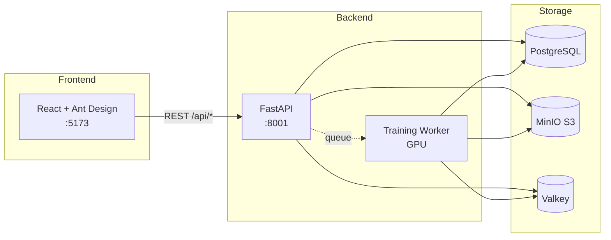
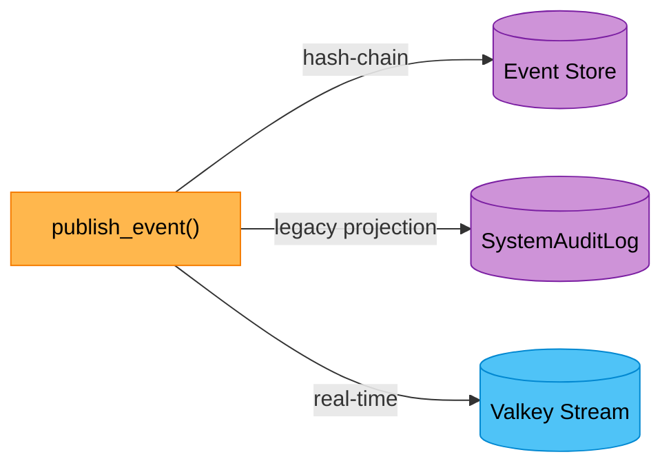
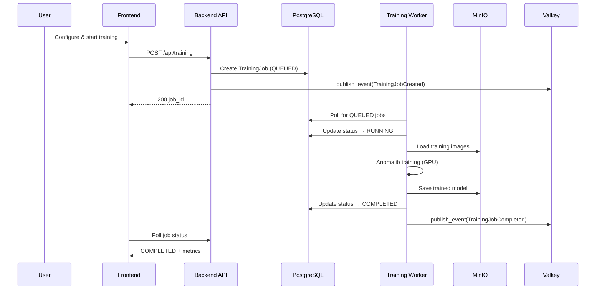
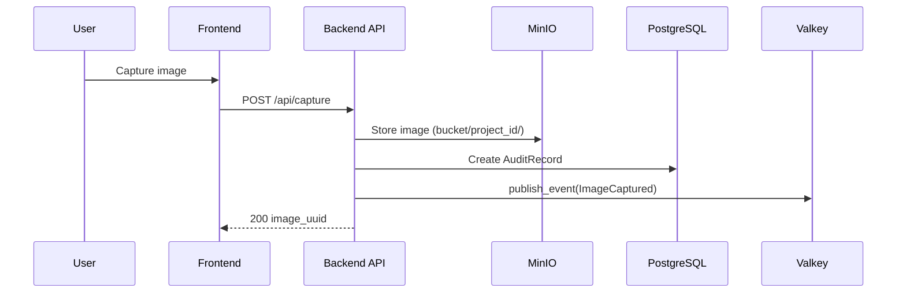

# Dataflow Documentation

> Auto-generated on 2026-03-24 04:21:34 | Optoz AI Documentation Watcher

---

## System Overview

## Frontend → Backend API Calls

| Page | Method | API Endpoint |
| --- | --- | --- |
| CaptureWorkspace | GET | `/camera/status` |
| CaptureWorkspace | POST | `/trigger/audit` |
| Deployment | GET | `/deployment/packages?project_id=${projectId}` |
| Deployment | GET | `/projects/${projectId}/models` |
| Deployment | POST | `/deployment/validate?job_id=${job.id}` |
| LabelingScreen | GET | `/projects/${projectId}/images/${imageUuid}/annotations` |
| LabelingScreen | GET | `/projects/${projectId}/images` |
| LabelingScreen | GET | `/projects/${projectId}/stats` |
| LabelingScreen | GET | `/projects/${projectId}` |
| LabelingScreen | POST | `/labeling/save` |
| LabelingScreen | POST | `/labeling/save-mask` |
| LabelingScreen | POST | `/projects/${projectId}/auto-assign-splits?train_pct=${train}&val_pct=${val}&test_pct=${test}` |
| LightingCalibration | GET | `/calibration/${projectId}` |
| LightingCalibration | POST | `/trigger/audit` |
| LightingCalibration | POST | `/calibration/reference` |
| LightingCalibration | POST | `/calibration/verify` |
| Login | POST | `/auth/token` |
| Login | GET | `/users/me` |
| ProjectHub | GET | `/projects` |
| ProjectHub | POST | `/projects` |
| ProjectSetup | GET | `/projects/${projectId}` |
| ProjectSetup | DELETE | `/projects/${projectId}` |
| ProjectSetup | POST | `/projects/${projectId}/duplicate` |
| ProjectSetup | PUT | `/projects/${projectId}` |
| TrainingSetup | GET | `/training/models` |
| TrainingSetup | GET | `/projects/${projectId}/stats` |
| TrainingSetup | GET | `/training/models/${selectedModel}/hyperparams` |
| TrainingSetup | POST | `/training/hpo/start` |
| TrainingSetup | POST | `/training/start` |
| Validation | GET | `/training/jobs` |
| Validation | GET | `/camera/status` |
| Validation | GET | `/projects/${projectId}/images` |
| Validation | GET | `/work-orders/${projectId}` |
| Validation | POST | `/trigger/audit` |
| Validation | POST | `/inference/test?job_id=${selectedJobId}` |
| Validation | POST | `/inference/scan-cancel/${scanJobId}` |
| Validation | POST | `/validation/per-defect?job_id=${selectedJobId}&project_id=${projectId}` |

## Backend Request Flows

### Audit Trail

| Method | Path | Handler |
| --- | --- | --- |
| GET | `/logs` | get_global_audit_logs |
| GET | `/latest` | get_latest |
| GET | `/event-types` | list_event_types |
| GET | `/events` | query_events |
| GET | `/events/verify` | verify_event_chain |
| GET | `/events/{aggregate_type}/{aggregate_id}` | get_aggregate_history |
| GET | `/provenance/{job_id}` | verify_provenance_chain |

**Services used:** vlk

**Storage:** PostgreSQL, Valkey

### Authentication

| Method | Path | Handler |
| --- | --- | --- |
| POST | `/token` | login_for_access_token |

**Storage:** Event Store (triple-write), PostgreSQL

### Calibration

| Method | Path | Handler |
| --- | --- | --- |
| POST | `/reference` | set_reference |
| POST | `/verify` | verify_calibration |
| GET | `/{project_id}/history` | get_calibration_history |
| GET | `/{project_id}` | get_calibration |

**Services used:** minio_client

**Storage:** Event Store (triple-write), MinIO, PostgreSQL

### Image Capture

| Method | Path | Handler |
| --- | --- | --- |
| GET | `/camera/status` | proxy_camera_status |
| POST | `/trigger/audit` | trigger_capture |
| GET | `/work-orders/{project_id}` | get_work_orders |

**Services used:** minio_client, vlk

**Storage:** Event Store (triple-write), MinIO, PostgreSQL, Valkey

### Validation

| Method | Path | Handler |
| --- | --- | --- |
| POST | `/per-defect` | per_defect_validation |

**Services used:** minio_client

**Storage:** MinIO, PostgreSQL

### Deployment

| Method | Path | Handler |
| --- | --- | --- |
| POST | `/validate` | validate_for_deployment |
| POST | `/create` | create_deployment_package |
| GET | `/packages` | list_deployment_packages |

**Storage:** Event Store (triple-write), PostgreSQL

### Inference

| Method | Path | Handler |
| --- | --- | --- |
| POST | `/inference/test` | test_inference |
| POST | `/inference/scan-dataset` | scan_dataset |
| GET | `/inference/scan-progress/{scan_job_id}` | get_scan_progress |
| POST | `/inference/scan-cancel/{scan_job_id}` | cancel_scan |
| GET | `/inference/stats/{project_id}` | get_inference_stats |

**Services used:** minio_client, vlk

**Storage:** Event Store (triple-write), MinIO, PostgreSQL, Valkey

### Labeling & Annotation

| Method | Path | Handler |
| --- | --- | --- |
| POST | `/audit/label` | label_image |
| POST | `/labeling/save` | save_label |
| POST | `/labeling/batch/complete` | complete_batch |
| GET | `/projects/{project_id}/images` | get_project_images |
| GET | `/projects/{project_id}/images/{image_uuid}` | get_project_image |
| GET | `/projects/{project_id}/stats` | get_labeling_stats |
| GET | `/projects/{project_id}/images/list` | list_project_images |
| POST | `/labeling/save-mask` | save_mask |
| GET | `/projects/{project_id}/images/{image_uuid}/annotations` | get_image_annotations |
| GET | `/projects/{project_id}/images/{image_uuid}/mask` | get_image_mask |

**Services used:** minio_client, vlk

**Storage:** Event Store (triple-write), MinIO, PostgreSQL, Valkey

### Production Monitoring

| Method | Path | Handler |
| --- | --- | --- |
| GET | `/summary/{project_id}` | get_production_summary |
| GET | `/report/{project_id}` | get_production_report |

**Storage:** PostgreSQL

### Project Management

| Method | Path | Handler |
| --- | --- | --- |
| GET | `` | list_projects |
| GET | `/{project_id}` | get_project |
| POST | `` | create_project |
| PUT | `/{project_id}` | update_project |
| DELETE | `/{project_id}` | delete_project |
| POST | `/{project_id}/duplicate` | duplicate_project |
| GET | `/{project_id}/models` | list_project_models |
| POST | `/{project_id}/auto-assign-splits` | auto_assign_splits |
| GET | `/{project_id}/monitor-config` | get_monitor_config_endpoint |
| PUT | `/{project_id}/monitor-config` | update_monitor_config |

**Services used:** minio_client, vlk

**Storage:** Event Store (triple-write), MinIO, PostgreSQL, Valkey

### SAM2 Segmentation

| Method | Path | Handler |
| --- | --- | --- |
| POST | `/predict` | predict_mask |

**Services used:** minio_client

**Storage:** MinIO, PostgreSQL

### Sample Projects

| Method | Path | Handler |
| --- | --- | --- |
| GET | `/categories` | list_categories |
| POST | `/create` | create_sample_project |
| GET | `/status/{task_id}` | get_import_status |

**Storage:** PostgreSQL

### Settings

| Method | Path | Handler |
| --- | --- | --- |
| GET | `` | get_settings |
| PUT | `` | update_settings |

**Storage:** Event Store (triple-write)

### System Health

| Method | Path | Handler |
| --- | --- | --- |
| GET | `/gpu` | get_gpu_status |
| GET | `/versions` | get_system_versions |
| GET | `/health` | get_system_health |

**Services used:** minio_client, vlk

**Storage:** MinIO, PostgreSQL, Valkey

### Model Training

| Method | Path | Handler |
| --- | --- | --- |
| POST | `/start` | start_training |
| POST | `/cancel/{job_id}` | cancel_job |
| POST | `/exploratory/{parent_job_id}/pause` | pause_exploratory |
| POST | `/exploratory/{parent_job_id}/resume` | resume_exploratory |
| GET | `/exploratory/{parent_job_id}` | get_exploratory_status |
| GET | `/jobs` | list_jobs |
| GET | `/jobs/{job_id}/logs` | get_job_logs |
| GET | `/jobs/{job_id}/audit` | get_job_audit_trail |
| POST | `/hpo/start` | start_hpo |
| GET | `/hpo/{job_id}` | get_hpo_status |
| POST | `/hpo/{job_id}/apply-best` | apply_hpo_best |
| GET | `/models` | list_models |
| GET | `/models/{model_id}/hyperparams` | get_model_hyperparams |

**Services used:** vlk

**Storage:** Event Store (triple-write), PostgreSQL, Valkey

### User Management

| Method | Path | Handler |
| --- | --- | --- |
| GET | `/me` | get_current_user_profile |
| PUT | `/me/password` | change_own_password |
| GET | `` | list_users |
| POST | `` | create_user |
| PUT | `/{user_id}` | update_user |
| PUT | `/{user_id}/reset-password` | reset_user_password |
| DELETE | `/{user_id}` | deactivate_user |

**Storage:** Event Store (triple-write), PostgreSQL

## Storage Layer Summary

| Store | Port | Purpose |
| --- | --- | --- |
| PostgreSQL | 5432 | Relational data: projects, training jobs, users, events, audit records, settings |
| MinIO | 9000 | Object storage: captured images, trained models, deployment packages |
| Valkey | 6379 | Event streaming: real-time event pub/sub, cache |

### Event Sourcing Triple-Write

Every state change writes to three sinks atomically:

## Key Feature Flows

### Training Pipeline

### Image Capture

