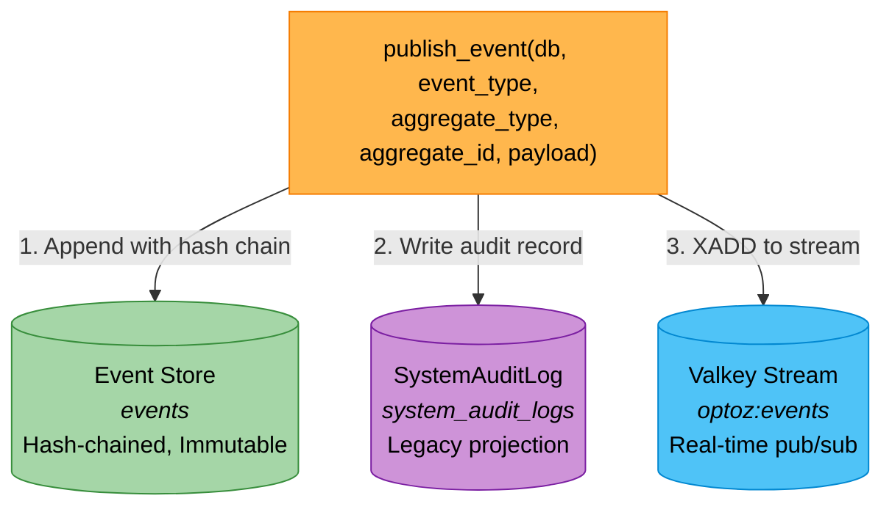
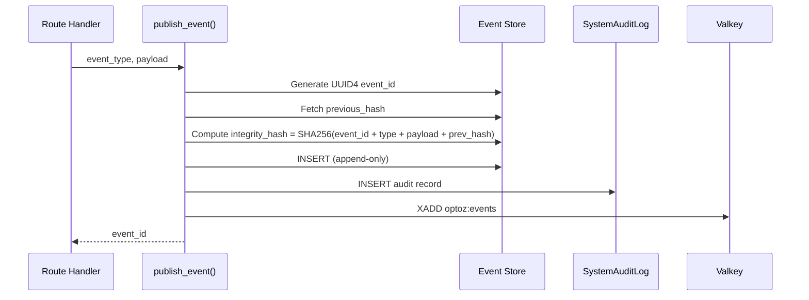
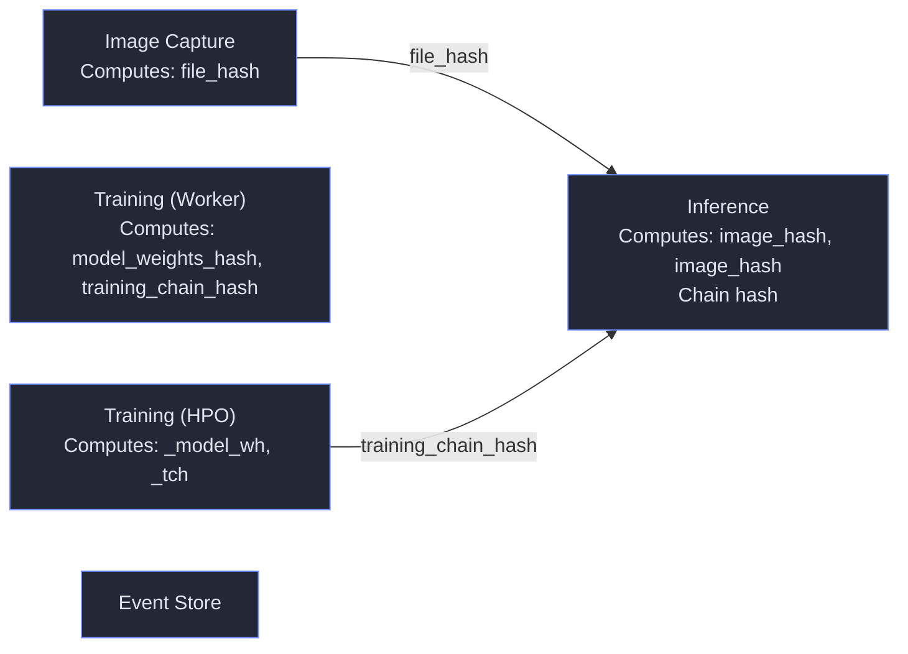

# Audit Trail Data Flow

> Auto-generated on 2026-03-24 04:21:34 | Optoz AI Documentation Watcher

---

## Event Type Registry

**36 event types registered**

| Event Type | Audit Action |
| --- | --- |
| ProjectCreated | CREATE_PROJECT |
| ProjectUpdated | UPDATE_PROJECT |
| ProjectDeleted | DELETE_PROJECT |
| ProjectDuplicated | DUPLICATE_PROJECT |
| CompliancePlanGenerated | GENERATE_COMPLIANCE_PLAN |
| SplitsAutoAssigned | AUTO_ASSIGN_SPLITS |
| ImageCaptured | CAPTURE_IMAGE |
| ImageLabeled | LABEL_IMAGE |
| LabelingBatchCompleted | COMPLETE_LABELING_BATCH |
| TrainingJobCreated | CMD_TRAIN |
| TrainingJobCompleted | TRAINING_COMPLETED |
| TrainingJobFailed | TRAINING_FAILED |
| TrainingJobCancelled | CMD_CANCEL_JOB |
| ExploratorySearchCancelled | CMD_CANCEL_EXPLORATORY |
| ExploratorySearchPaused | CMD_PAUSE_EXPLORATORY |
| ExploratorySearchResumed | CMD_RESUME_EXPLORATORY |
| InferenceRun | INFERENCE_RUN |
| DeploymentPackageCreated | CREATE_DEPLOYMENT_PACKAGE |
| UserLoggedIn | USER_LOGIN |
| SettingsUpdated | SETTINGS_UPDATED |
| MaskAnnotated | MASK_ANNOTATED |
| ExploratorySearchCompleted | EXPLORATORY_COMPLETED |
| HPOJobCreated | CMD_HPO |
| HPOJobCompleted | HPO_COMPLETED |
| HPOTrialCompleted | HPO_TRIAL |
| UserCreated | USER_CREATED |
| UserUpdated | USER_UPDATED |
| UserDeactivated | USER_DEACTIVATED |
| PasswordReset | PASSWORD_RESET |
| PasswordChanged | PASSWORD_CHANGED |
| SystemVersionSnapshot | VERSION_SNAPSHOT |
| CalibrationReferenceSet | CALIBRATION_REFERENCE_SET |
| CalibrationVerified | CALIBRATION_VERIFIED |
| CalibrationFailed | CALIBRATION_FAILED |
| SampleProjectImported | SAMPLE_PROJECT_IMPORTED |
| MonitorConfigUpdated | MONITOR_CONFIG_UPDATED |

## Triple-Write Architecture

### Integrity Chain

This forms an append-only, tamper-evident log (21 CFR Part 11 compliant).

## Event Sources by Route

| Route Module | Event Type |
| --- | --- |
| auth | UserLoggedIn |
| calibration | CalibrationFailed |
| calibration | CalibrationReferenceSet |
| calibration | CalibrationVerified |
| capture | ImageCaptured |
| deployment | DeploymentPackageCreated |
| inference | InferenceRun |
| labeling | ImageLabeled |
| labeling | LabelingBatchCompleted |
| labeling | MaskAnnotated |
| projects | CompliancePlanGenerated |
| projects | MonitorConfigUpdated |
| projects | ProjectCreated |
| projects | ProjectDeleted |
| projects | ProjectDuplicated |
| projects | SplitsAutoAssigned |
| settings | SettingsUpdated |
| training | ExploratorySearchCancelled |
| training | ExploratorySearchPaused |
| training | ExploratorySearchResumed |
| training | HPOJobCreated |
| training | TrainingJobCancelled |
| training | TrainingJobCreated |
| users | PasswordChanged |
| users | PasswordReset |
| users | UserCreated |
| users | UserDeactivated |
| users | UserUpdated |

```mermaid
graph LR
    auth["auth"]:::route
    UserLoggedIn(["UserLoggedIn"]):::event
    auth --> UserLoggedIn
    calibration["calibration"]:::route
    CalibrationFailed(["CalibrationFailed"]):::event
    calibration --> CalibrationFailed
    CalibrationReferenceSet(["CalibrationReferenceSet"]):::event
    calibration --> CalibrationReferenceSet
    CalibrationVerified(["CalibrationVerified"]):::event
    calibration --> CalibrationVerified
    capture["capture"]:::route
    ImageCaptured(["ImageCaptured"]):::event
    capture --> ImageCaptured
    deployment["deployment"]:::route
    DeploymentPackageCreated(["DeploymentPackageCreated"]):::event
    deployment --> DeploymentPackageCreated
    inference["inference"]:::route
    InferenceRun(["InferenceRun"]):::event
    inference --> InferenceRun
    labeling["labeling"]:::route
    ImageLabeled(["ImageLabeled"]):::event
    labeling --> ImageLabeled
    LabelingBatchCompleted(["LabelingBatchCompleted"]):::event
    labeling --> LabelingBatchCompleted
    MaskAnnotated(["MaskAnnotated"]):::event
    labeling --> MaskAnnotated
    projects["projects"]:::route
    CompliancePlanGenerated(["CompliancePlanGenerated"]):::event
    projects --> CompliancePlanGenerated
    MonitorConfigUpdated(["MonitorConfigUpdated"]):::event
    projects --> MonitorConfigUpdated
    ProjectCreated(["ProjectCreated"]):::event
    projects --> ProjectCreated
    projectsmore(["...+3 more"]):::event
    projects --> projectsmore
    settings["settings"]:::route
    SettingsUpdated(["SettingsUpdated"]):::event
    settings --> SettingsUpdated
    training["training"]:::route
    ExploratorySearchCancelled(["ExploratorySearchCancelled"]):::event
    training --> ExploratorySearchCancelled
    ExploratorySearchPaused(["ExploratorySearchPaused"]):::event
    training --> ExploratorySearchPaused
    ExploratorySearchResumed(["ExploratorySearchResumed"]):::event
    training --> ExploratorySearchResumed
    trainingmore(["...+3 more"]):::event
    training --> trainingmore
    users["users"]:::route
    PasswordChanged(["PasswordChanged"]):::event
    users --> PasswordChanged
    PasswordReset(["PasswordReset"]):::event
    users --> PasswordReset
    UserCreated(["UserCreated"]):::event
    users --> UserCreated
    usersmore(["...+2 more"]):::event
    users --> usersmore
    classDef route fill:#81C784,stroke:#388E3C,color:#000
    classDef event fill:#FFE082,stroke:#F9A825,color:#000
```

## Event Store Schema

| Column | Type |
| --- | --- |
| id | Integer |
| event_id | String |
| event_type | String |
| aggregate_type | String |
| aggregate_id | String |
| project_id | String |
| timestamp | DateTime |
| user_id | String |
| payload | Text |
| event_metadata | Text |
| previous_hash | String |
| integrity_hash | String |

### SystemAuditLog Schema

| Column | Type |
| --- | --- |
| id | Integer |
| timestamp | DateTime |
| user_id | String |
| action_type | String |
| resource_id | String |
| details | Text |
| previous_hash | String |
| integrity_hash | String |

## Training Worker Events

The training worker publishes events independently (same triple-write pattern):

| Event Type | Audit Action |
| --- | --- |
| TrainingJobCompleted | TRAINING_COMPLETED |
| TrainingJobFailed | TRAINING_FAILED |
| ExploratorySearchCompleted | EXPLORATORY_COMPLETED |
| HPOJobCreated | CMD_HPO |
| HPOJobCompleted | HPO_COMPLETED |
| HPOTrialCompleted | HPO_TRIAL |
| source | training_worker |
| aggregate_type | TrainingJob |

## Image Provenance — Hash Chain Across Lifecycle

_Parsed live from source code. Shows how image identity (hashes) flows through each stage._

| Stage | File | Computes | Reads | Event Hash Fields |
| --- | --- | --- | --- | --- |
| Image Capture | `app/routes/capture.py` | SHA256(image_bytes) → file_hash | — | — |
| Training (Worker) | `training/trainer.py` | compute_model_hash() → model_weights_hash, compute_training_chain_hash() → training_chain_hash, create_dataset_manifest() → dataset_manifest | .get("total_hash") | — |
| Training (HPO) | `training/hpo.py` | compute_model_hash() → _model_wh, compute_training_chain_hash() → _tch, create_dataset_manifest() → _manifest | .get("total_hash") | HPOJobCompleted: training_chain_hash, model_weights_hash, dataset_total_hash |
| Inference | `app/routes/inference.py` | SHA256(contents) → image_hash, SHA256(img_bytes) → image_hash | .get("training_chain_hash"), img_hash ← cap.file_hash, image_hash ← record.file_hash | InferenceRun: image_hash, training_chain_hash, inference_chain_hash |
| Event Store | `app/services/event_store.py` | — | previous_hash ← last_event.integrity_hash | — |

### Database Columns Storing Hashes

| Model | Column | Type |
| --- | --- | --- |
| Event | previous_hash | String |
| Event | integrity_hash | String |
| AuditRecord | file_hash | String |
| User | hashed_password | String |
| SystemAuditLog | previous_hash | String |
| SystemAuditLog | integrity_hash | String |

### Hash Flow Connections

| From | To | Via |
| --- | --- | --- |
| Image Capture | Inference | `file_hash` |
| Training (HPO) | Inference | `training_chain_hash` |

