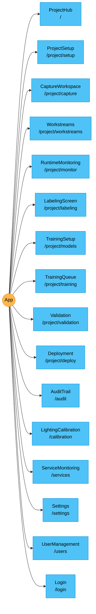

# Visual Design Log & Layout

> Auto-generated on 2026-03-24 04:21:34 | Optoz AI Documentation Watcher

---

## Navigation & Routing

### Route Map

### Route Definitions

| Path | Component |
| --- | --- |
| `/` | ProjectHub |
| `/project/setup` | ProjectSetup |
| `/project/capture` | CaptureWorkspace |
| `/project/workstreams` | Workstreams |
| `/project/monitor` | RuntimeMonitoring |
| `/project/labeling` | LabelingScreen |
| `/project/models` | TrainingSetup |
| `/project/training` | TrainingQueue |
| `/project/validation` | Validation |
| `/project/deploy` | Deployment |
| `/audit` | AuditTrail |
| `/calibration` | LightingCalibration |
| `/services` | ServiceMonitoring |
| `/settings` | Settings |
| `/users` | UserManagement |
| `/login` | Login |

## Page Components

### AuditTrail

**Ant Design:** Button, Card, Col, Collapse, Descriptions, Layout, Row, Select, Space, Table, Tag

_Lines: 411_

### CaptureWorkspace

**Ant Design:** Alert, Button, Card, Col, Divider, Input, Row, Space, Tag, Tooltip

| Method | API Endpoint |
| --- | --- |
| GET | `/camera/status` |
| POST | `/trigger/audit` |

_Lines: 341_

### Deployment

**Ant Design:** Alert, Badge, Button, Card, Col, Descriptions, Input, Modal, Progress, Row, Space, Statistic, Table, Tag

| Method | API Endpoint |
| --- | --- |
| GET | `/deployment/packages?project_id=${projectId}` |
| GET | `/projects/${projectId}/models` |
| POST | `/deployment/validate?job_id=${job.id}` |

_Lines: 479_

### LabelingScreen

**Ant Design:** Button, Col, Collapse, Divider, Input, Layout, Progress, Row, Select, Space, Spin, Tag, Tooltip

| Method | API Endpoint |
| --- | --- |
| GET | `/projects/${projectId}/images/${imageUuid}/annotations` |
| GET | `/projects/${projectId}/images` |
| GET | `/projects/${projectId}/stats` |
| GET | `/projects/${projectId}` |
| POST | `/labeling/save` |
| POST | `/labeling/save-mask` |
| POST | `/projects/${projectId}/auto-assign-splits?train_pct=${train}&val_pct=${val}&test_pct=${test}` |

_Lines: 805_

### LightingCalibration

**Ant Design:** Alert, Button, Card, Col, Divider, Row, Space, Statistic, Tag

| Method | API Endpoint |
| --- | --- |
| GET | `/calibration/${projectId}` |
| POST | `/trigger/audit` |
| POST | `/calibration/reference` |
| POST | `/calibration/verify` |

_Lines: 460_

### Login

**Ant Design:** Button, Card, Form, Input

| Method | API Endpoint |
| --- | --- |
| POST | `/auth/token` |
| GET | `/users/me` |

_Lines: 93_

### ProjectHub

**Ant Design:** Button, Card, Form, Input, Modal, Spin

| Method | API Endpoint |
| --- | --- |
| GET | `/projects` |
| POST | `/projects` |

_Lines: 138_

### ProjectSetup

**Ant Design:** Alert, Button, Card, Col, Divider, Form, Input, Row, Select, Space, Steps, Upload

| Method | API Endpoint |
| --- | --- |
| GET | `/projects/${projectId}` |
| DELETE | `/projects/${projectId}` |
| POST | `/projects/${projectId}/duplicate` |
| PUT | `/projects/${projectId}` |

_Lines: 326_

### RuntimeMonitoring

**Ant Design:** Alert, Button, Card, Col, Collapse, Drawer, Form, Progress, Row, Select, Space, Spin, Statistic, Table, Tag

_Lines: 670_

### ServiceMonitoring

**Ant Design:** Button, Card, Col, Progress, Row, Space, Spin, Tag

_Lines: 344_

### Settings

**Ant Design:** Alert, Button, Card, Form, Input, Layout, Select, Space, Spin

_Lines: 181_

### TrainingQueue

**Ant Design:** Badge, Button, Card, Col, Drawer, Layout, Progress, Row, Space, Statistic, Table, Tabs, Tag, Timeline, Tooltip

_Lines: 1347_

### TrainingSetup

**Ant Design:** Alert, Badge, Button, Card, Col, Divider, Form, Row, Select, Space, Statistic, Tag

| Method | API Endpoint |
| --- | --- |
| GET | `/training/models` |
| GET | `/projects/${projectId}/stats` |
| GET | `/training/models/${selectedModel}/hyperparams` |
| POST | `/training/hpo/start` |
| POST | `/training/start` |

_Lines: 688_

### UserManagement

**Ant Design:** Alert, Badge, Button, Card, Form, Input, Layout, Modal, Select, Space, Table, Tag

_Lines: 354_

### Validation

**Components:** ScatterTooltipContent

**Ant Design:** Alert, Button, Card, Col, Divider, Progress, Row, Select, Space, Spin, Statistic, Tag

| Method | API Endpoint |
| --- | --- |
| GET | `/training/jobs` |
| GET | `/camera/status` |
| GET | `/projects/${projectId}/images` |
| GET | `/work-orders/${projectId}` |
| POST | `/trigger/audit` |
| POST | `/inference/test?job_id=${selectedJobId}` |
| POST | `/inference/scan-cancel/${scanJobId}` |
| POST | `/validation/per-defect?job_id=${selectedJobId}&project_id=${projectId}` |

_Lines: 1163_

## Shared Components

_No shared components found._

